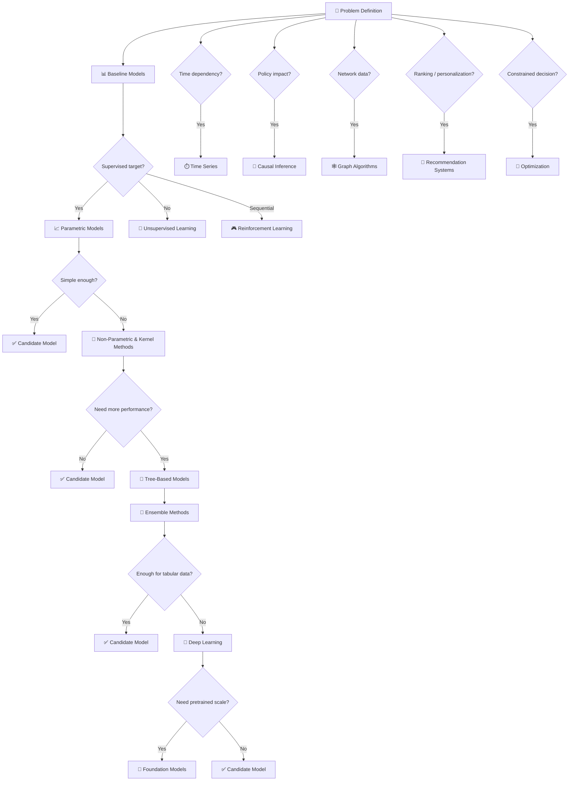

# 🧭 Algorithm Families Overview

This section summarizes the **main families of Machine Learning algorithms**, organized in a clean, mutually exclusive taxonomy — from traditional statistical models to modern AI paradigms.

Each page in this section provides detailed theory, use cases, and best practices for every algorithm family.

---

## 🗂️ Algorithm Families

| Category | Description | Examples |
|-----------|--------------|-----------|
| [📊 **Parametric Models**](parametric_models.md) | Models with a fixed mathematical form defined by a finite number of parameters. | Linear Regression, GLM, LDA, GAM |
| [🧮 **Others Non-Parametric & Kernel Methods**](non_parametric_models.md) | Flexible models that adapt to data shape with no predefined function. | kNN, SVM, Kernel Regression, MARS |
| [🌳 **Tree-Based Models**](tree_based_models.md) | Recursive partitioning of the feature space into homogeneous regions. | CART, C4.5, CHAID, Model Trees |
| [🌲 **Ensemble Methods**](ensemble_methods.md) | Combine multiple models for stronger and more stable predictions. | Random Forest, XGBoost, AdaBoost |
| [🧩 **Clustering**](clustering.md) | Unsupervised grouping of similar observations. | K-Means, DBSCAN, GMM, SOM |
| [⏱️ **Time Series**](time_series.md) | Forecasting and temporal dependency modeling. | ARIMA, Exponential Smoothing, Prophet |
| [🗣️ **Natural Language Processing (NLP)**](nlp.md) | Algorithms for text and language understanding. | TF-IDF, Word2Vec, BERT, GPT |
| [🚨 **Anomaly Detection**](anomaly_detection.md) | Identify unusual or unexpected data patterns. | Isolation Forest, LOF, One-Class SVM |
| [🧠 **Deep Learning**](deep_learning.md) | Multi-layer neural architectures for feature learning. | CNN, RNN, Transformer, Autoencoder |
| [🎮 **Reinforcement Learning**](reinforcement_learning.md) | Agents learning by reward and feedback. | Q-Learning, DQN, PPO, A3C |
| [🕸️ **Graph Algorithms**](graph_algorithms.md) | Learning on networks and relational structures. | PageRank, GCN, Node2Vec |
| [↘️ **Dimensionality Reduction**](dimensionality_reduction.md) | Simplify data representation while preserving structure. | PCA, UMAP, ICA, Autoencoder |
| [🎯 **Recommendation Systems**](recommendation_systems.md) | Predict user preferences or item relevance. | Collaborative Filtering, SVD, NCF |
| [∑ **Bayesian Methods**](bayesian_methods.md) | Probabilistic inference models with priors and uncertainty. | Naïve Bayes, MCMC, Gaussian Process |
| [🧬 **Evolutionary Algorithms**](evolutionary_algorithms.md) | Optimization inspired by biological evolution. | Genetic Algorithm, PSO, Differential Evolution |
| [⚙️ **Hybrid Models**](hybrid_models.md) | Combine different paradigms for improved performance. | Neuro-Evolutionary, Deep+Graph, Ensemble+Bayesian |

---

---

## 🔍 Relationships Between Families

- **Parametric → Non-Parametric → Tree-Based → Ensemble**  
  Each step usually adds flexibility, complexity, and predictive capacity.

- **Deep Learning** introduces representation learning, allowing models to learn complex feature representations directly from data.

- **Foundation Models** extend Deep Learning through large-scale pretraining, transfer learning, and reusable representations.

- **Reinforcement Learning** introduces sequential decision-making based on actions, rewards, and future states.

- **Bayesian Methods** add uncertainty quantification and probabilistic inference.

- **Graph Algorithms and Recommender Systems** are specialized domains that can combine classical ML, non-parametric methods, Deep Learning, and Foundation Models depending on the problem.

- **Evolutionary Algorithms** use heuristic search to optimize solutions when gradients or exact optimization are difficult.

- **Causal Inference** focuses on estimating treatment effects, policy impact, and intervention outcomes rather than only prediction.

- **Hybrid Models** integrate multiple paradigms for robustness, interpretability, or operational constraints.
---

## 📚 References

- Hastie, Tibshirani & Friedman — *The Elements of Statistical Learning* (2009)  
- Kuhn & Johnson — *Applied Predictive Modeling* (2013)  
- Goodfellow, Bengio & Courville — *Deep Learning* (2016)  
- Russell & Norvig — *Artificial Intelligence: A Modern Approach* (2020)  
- Murphy — *Probabilistic Machine Learning* (2022)

