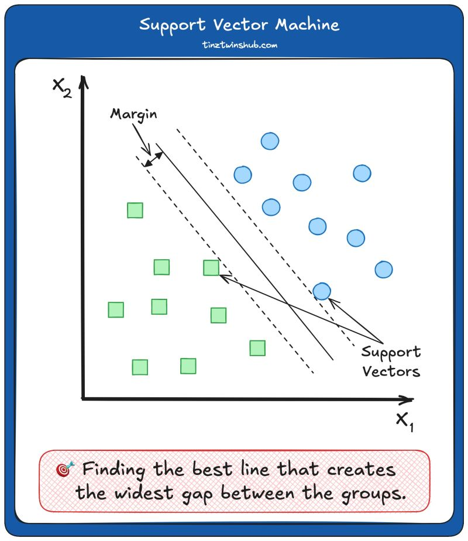

Modelos baseados na estrutura dos dados — sem forma funcional fixa.

Inclui:

- kNN, Distance-Weighted kNN
- Kernel Regression, LOESS, KDE
- MARS, Smoothing Splines
- LVQ (Learning Vector Quantization)

## Support Vector Machine (SVM)

Geralmente utilizado em contextos de classificação, encontra um hiperplano (podendo ser uma linha) para segregar categorias

Imagine you've a set of points on a piece of paper, and you want to draw a line that separates them into two groups. That's what SVMs do. SVM is like finding the best line that creates the widest gap between groups.

1. Create Space: looks for the best line (or hyperplane in higher dimensions) to saparate different groups of points.
2. Maximize Gap: It wants to maximaze the space (gap) between the points of each group. This helps the line be more robust and better at classifying new points
3. Support Vectors: We call the points closest to the line and influence its position support vectors. These points are crucial in defining the best line. The margin is the distance between the best line and the points closest to the best line (support vectors).
4.  Kernel Trick: SVM can use a "kernel trick" to handle more complex situations. It transforms the original space into a higher-dimensional space, making it easier to find a separating line.
5. Classification: Once the best line is found, SVM can quickly classify new points by checking which side of the line the points fall on. In simple terms, SVM finds the best line to separate different types of points.

