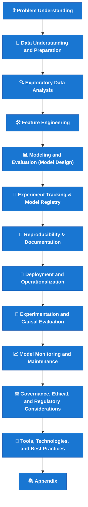

Projeto pessoal para consulta desde Guia de Modelagem,  boas práticas, até Study Notes, Links e Artigos interessantes e suas respectivas referências

Below is the end-to-end structure of your modeling guideline.

| Stage                                                     | Description                                                     | Key Outputs                                |
| --------------------------------------------------------- | --------------------------------------------------------------- | ------------------------------------------ |
| **❓ Problem Understanding**                               | Define the business question, success metrics, and scope.       | Problem statement, KPIs, hypothesis.       |
| **🧩 Data Understanding and Preparation**                 | Collect, assess quality, and preprocess data.                   | Clean datasets, data dictionary.           |
| **🔍 Exploratory Data Analysis**                          | Explore data structure, distributions, and correlations.        | Descriptive statistics, visualizations.    |
| **🧱 Feature Engineering**                                | Create and transform variables to improve model signal.         | Feature set, scaling, encoding.            |
| **📊 Modeling and Evaluation (Model Design)**             | Select algorithms, train, validate, and compare models.         | Trained models, performance report.        |
| **🧾 Experiment Tracking & Model Registry**               | Log hyperparameters, datasets, and versions.                    | Experiment logs, model registry entries.   |
| **📘 Reproducibility & Documentation**                    | Ensure replicability of experiments and transparency.           | Code versioning, metadata, notebooks.      |
| **🚀 Deployment and Operationalization**                  | Move the model into production environment.                     | Model pipeline, API, infrastructure setup. |
| **🧪 Experimentation and Causal Evaluation**              | Test interventions or model impact via A/B or causal inference. | Experimental results, uplift metrics.      |
| **📈 Model Monitoring and Maintenance**                   | Track performance drift, retrain and update models.             | Monitoring dashboard, alert system.        |
| **⚖️ Governance, Ethical, and Regulatory Considerations** | Align modeling with fairness, compliance, and policies.         | Model cards, risk documentation.           |
| **🧰 Tools, Technologies, and Best Practices**            | Tools, frameworks, and coding standards.                        | Stack overview, reproducible workflow.     |
| **📚 Appendix**                                           | Complementary references, formulas, or datasets.                | Additional documentation.                  |

 

| Stage                                        | Description                              |
| -------------------------------------------- | ---------------------------------------- |
| **❓ Problem Understanding**                  | Define the business goal and KPIs.       |
| **🧩 Data Understanding and Preparation**    | Collect, clean, and preprocess datasets. |
| **🔍 Exploratory Data Analysis**             | Explore distributions and correlations.  |
| **🧱 Feature Engineering**                   | Create variables and transformations.    |
| **📊 Modeling and Evaluation**               | Train, tune, and validate models.        |
| **🧾 Experiment Tracking & Model Registry**  | Log experiments and versions.            |
| **📘 Reproducibility & Documentation**       | Ensure transparency and replication.     |
| **🚀 Deployment and Operationalization**     | Move model into production.              |
| **🧪 Experimentation and Causal Evaluation** | A/B tests, uplift, causal impact.        |
| **📈 Model Monitoring and Maintenance**      | Detect drift, monitor performance.       |
| **⚖️ Governance, Ethical, and Regulatory**   | Compliance and fairness checks.          |
| **🧰 Tools & Best Practices**                | Frameworks, coding standards.            |
| **📚 Appendix**                              | Additional resources.                    |

 

